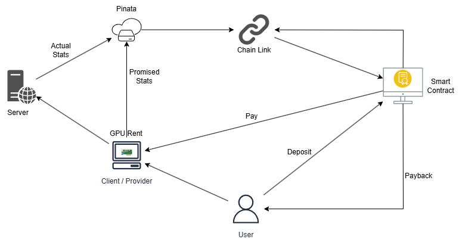

# Decentralized GPU Rental Platform

A blockchain-based platform for renting GPUs with automated performance verification and fair payment distribution.

🌐 **Live Demo**: [https://rent-gpu-phi.vercel.app/](https://rent-gpu-phi.vercel.app/)

## 📋 Project Overview

This project implements a decentralized GPU rental marketplace that solves the trust and verification problems in traditional GPU rental systems. Using Chainlink Functions and smart contracts, we provide automated performance verification and fair payment distribution based on actual GPU performance.

The platform is deployed and running on Vercel, making it easily accessible to users worldwide.

## 📺 Demo Video

[](https://youtu.be/bkhyJNmIk-w)

## 🎯 Technical Features

- **Smart Contract Security**: Implements escrow mechanism with automated verification
- **Performance Verification**:
  - Compares actual vs promised GPU specifications
  - Uses Chainlink Functions for trustless verification
- **Fair Payment System**:
  - Automatic payment adjustment based on performance score
  - Proportional refunds for underperforming GPUs
  - Real-time transaction tracking
- **Decentralized Storage**:
  - GPU specifications stored on IPFS
  - Immutable performance records
  - Transparent verification results

## 💻 System Requirements

- Node.js v16 or higher
- MetaMask wallet with Sepolia testnet ETH
- Modern web browser with MetaMask extension
- Git

## 🏗️ Architecture



### System Components

- **Server**: Monitors and reports actual GPU usage statistics
- **Pinata**: Handles IPFS storage for stats and verification
- **Chain Link**: Provides oracle services for data verification
- **Smart Contract**: Manages rental agreements, payments, and deposits
- **Client/Provider**: Offers GPU resources for rental
- **User**: Rents GPU resources and provides deposits

### Directory Structure

```
├── frontend/               # React-based web interface
├── SmartContract/         # Solidity smart contracts
└── docs/                  # Documentation
```

## 🛠️ Technology Stack

- **Frontend**: React.js, Bootstrap
- **Blockchain**: Ethereum (Sepolia Testnet)
- **Smart Contracts**: Solidity
- **External Services**:
  - Chainlink Functions
  - IPFS (Pinata)
  - Web3.js/Ethers.js

## 🔧 Setup & Installation

1. Clone the repository:

```bash
git clone https://github.com/NNPhaniCharan/RentGPU.git
cd RentGPU
```

2. Install frontend dependencies:

```bash
cd frontend
npm install
```

3. Configure environment variables:

```bash
# Create .env file in frontend directory
REACT_APP_GATEWAY_URL=your_pinata_gateway_url
REACT_APP_PINATA_API_KEY=your_pinata_api_key
REACT_APP_PINATA_SECRET_KEY=your_pinata_api_secret_key

REACT_APP_CONTRACT_ADDRESS=0xE590ff0E4FB5fCE671053ED5091F215204F49433
```

4. Start the development server:

```bash
npm start
```

## 🔄 Workflow

1. **Rental Process**:

   - User selects a GPU and makes payment in ETH
   - Payment is held in smart contract escrow
   - Provider uploads performance metrics to IPFS

2. **Verification Process**:

   - Chainlink Functions fetch and compare actual vs promised performance
   - Smart contract calculates fulfillment percentage
   - Payment is distributed proportionally based on performance

3. **Payment Distribution**:
   - Provider receives payment based on delivered performance
   - User receives refund for any underperformance

## 📝 Smart Contract Details

- **Network**: Sepolia Testnet
- **Contract Address**: `0xE590ff0E4FB5fCE671053ED5091F215204F49433`
- **Chainlink Functions Subscription ID**: `4553`

## 👥 Team

- _Narayana Phani Charan Nimmagadda_
- _Sai Madhukar Vanam_

## 🌟 Acknowledgments

- Chainlink Functions for enabling automated performance verification
- IPFS/Pinata for decentralized storage

## 🚀 Deployment

The application is deployed and hosted on Vercel:

- **Live URL**: [https://rent-gpu-phi.vercel.app/](https://rent-gpu-phi.vercel.app/)
- **Deployment Platform**: Vercel
- **Status**: Active
